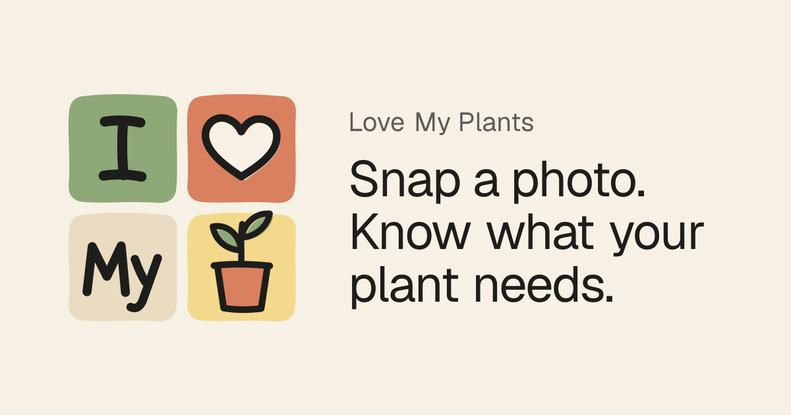
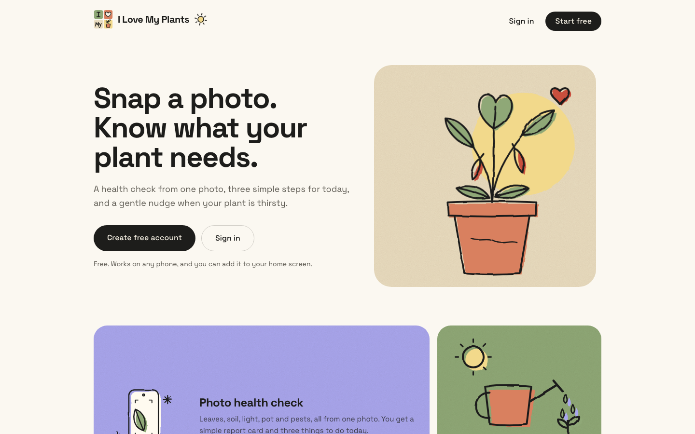
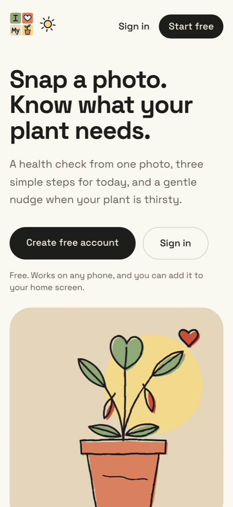
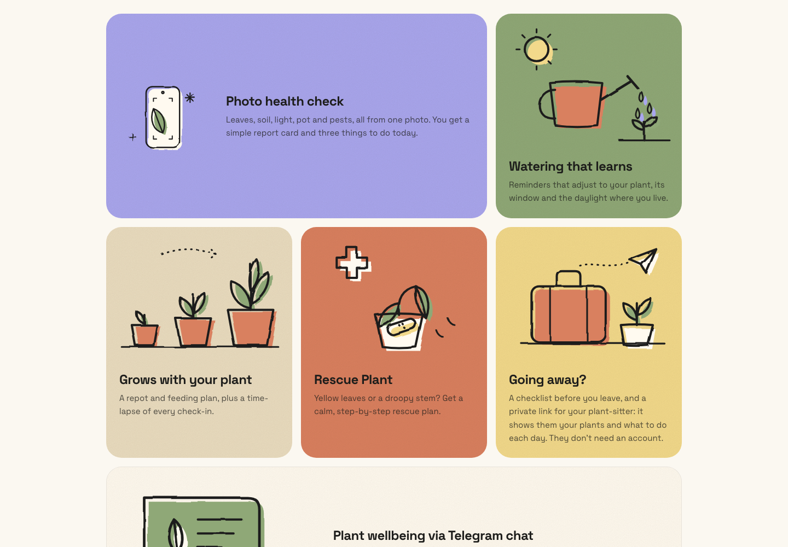
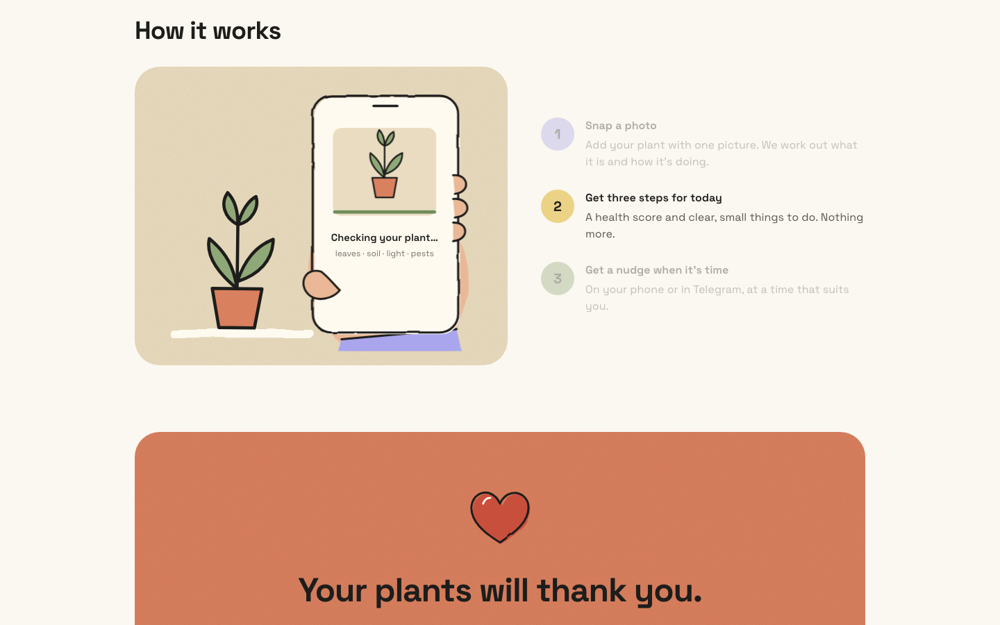
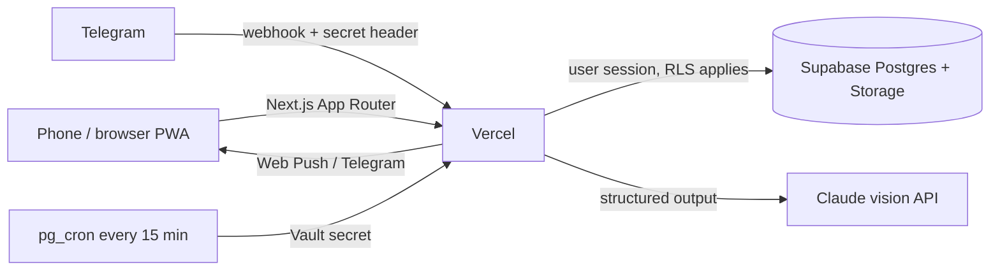

<p align="center">
  
</p>

<p align="center">
  <a href="https://love-my-plants.vercel.app"><b>Live app →</b></a>
  ·
  <a href="#features">Features</a>
  ·
  <a href="#how-its-built">How it's built</a>
  ·
  <a href="#run-it-yourself">Run it yourself</a>
</p>

<p align="center">
  
  
  
  
  
  
  
  
</p>

# Love My Plants 🪴

**Snap a photo of a house plant and know what it needs.** Love My Plants gives you a health check
from one photo, three small things to do today, and watering reminders that learn from your plant,
its window and the daylight where you live. It can also make a rescue plan for a struggling plant,
prepare your plants for a holiday, and give a friend a no-account plant-sitting link. A Telegram
"Plant Buddy" sends your reminders and answers questions in chat.

It's a real, deployed product, built end to end: product design, hand-drawn illustration style,
database security, AI integration, messaging and scheduling.

<p align="center">
  
  &nbsp;
  
</p>

## Features



| | Feature | What it does |
|---|---|---|
| 📸 | **Photo health check** | One photo → species, health score and a report card on leaves, soil, light, pot and pests, plus three steps for today. |
| 💧 | **Watering that learns** | Every "soil was dry / still damp" answer tunes the interval. Seasons follow real daylight hours at your (rounded) location, and window direction matters, including in-between ones like SW. |
| 🌱 | **Grows with your plant** | Repot and feeding plan, weekly check-ins with a "ghost" camera overlay to line up the same shot, a health trend chart and a growth time-lapse. |
| 🚑 | **Rescue Plant** | Yellow leaves or a droopy stem? A short triage, then a calm day-by-day rescue plan you tick off. |
| 🧳 | **Going away** | A checklist before you leave, and a private link for your plant-sitter showing what to do each day. Sitters don't need an account and can connect Telegram for reminders. |
| 👨‍👩‍👧 | **Care Circle** | Invite household members to share plants. Sitter access is limited to chosen plants and dates. |
| 💬 | **Telegram Plant Buddy** | Daily reminders with one-tap answers, questions about your plants, and a product-photo check ("is this fertiliser OK for my pepper?") that adds to a shopping list. |
| 📱 | **Installable PWA** | Add to home screen, push notifications with one-tap answers, bottom tab bar on phones and a sidebar on desktop. |

### How it works



## How it's built



| Layer | Choices |
|---|---|
| **Frontend** | Next.js 16 (App Router, Server Components, route groups), React 19, Tailwind CSS 4, hand-drawn SVG illustrations, PWA with service worker and Web Push |
| **Backend** | Next.js route handlers, Zod validation on every request, one shared error format ("what happened. what to do.") |
| **Database** | Supabase Postgres with row-level security on every table, 14 versioned SQL migrations, SQL tests for the access rules |
| **AI** | Anthropic Claude vision with schema-validated structured output for photo assessments, and a chat buddy that also checks product photos; per-user daily limits |
| **Scheduling** | Supabase `pg_cron` + `pg_net` call the reminder endpoint every 15 minutes; each user gets their digest at their own local time |
| **Messaging** | Telegram Bot API (webhook in production, long polling for local development) and Web Push (VAPID) |
| **Hosting** | Vercel, deployed from `main` |

### Engineering highlights

- **Security first.** RLS on every table with a single `has_plant_access()` rule that also covers
  plant-sitter date windows and plant scope. Invite and link tokens are stored only as hashes.
  Nonce-based CSP, HSTS and frame blocking on every response. Webhook and cron secrets are checked in
  constant time, and the cron secret never leaves the database. See [SECURITY.md](SECURITY.md).
- **Care logic as pure, tested functions.** Watering intervals, daylight by latitude, repot plans,
  rescue schedules, vacation prep and time-zone-aware digests live in `src/lib/care/` and are covered
  by 86 unit tests.
- **AI you can trust.** Model output is parsed against Zod schemas before anything is stored, and
  failures turn into clear, actionable messages instead of broken screens.
- **Privacy by default.** Addresses are geocoded once and stored rounded to about 1 km. Sitter pages
  are `noindex` and send no referrer, so private links don't leak.
- **Friendly errors everywhere.** Every error tells the user what happened and what to do, including
  when to try again after hitting a limit.

## Run it yourself

You need Node.js 22+, a [Supabase](https://supabase.com) project and an
[Anthropic API key](https://console.anthropic.com). Telegram and Web Push are optional.

```bash
git clone https://github.com/andriuskleinas/love-my-plants.git
cd love-my-plants
npm install
cp .env.example .env.local   # fill in your own keys; never commit .env.local
npm run dev
```

Apply the SQL files in `supabase/migrations/` to your Supabase project, in order.

### Tests

```bash
npm test          # care logic: watering, repot plan, access rules, AI output schema
```

Database access rules (RLS) can be checked against a throwaway local Postgres:

```bash
psql -d <scratch_db> -f supabase/tests/stubs.sql \
  -f supabase/migrations/20261003000000_init.sql \
  -f supabase/tests/rls_test.sql
```

### Production notes

- **Environment variables** go in Vercel → Project → Settings → Environment Variables
  (same names as `.env.example`; `CRON_SECRET` is only for local runs).
- **Reminders** run every 15 minutes from Supabase (`pg_cron` + `pg_net`) calling
  `/api/cron/reminders`. The bearer secret is generated inside the database (Vault) and checked by
  `verify_cron_secret()`. To point the job at a new domain:
  `select private.schedule_reminders('https://your-domain');`
- **Telegram** delivers updates by webhook to `/api/telegram`, authenticated with
  `TELEGRAM_WEBHOOK_SECRET`. `npm run telegram` (local long polling) removes the webhook, so
  set it again afterwards.
- **Supabase Auth**: email + password and Google. The production URL must be the Site URL and be in
  Redirect URLs (password-reset and Google sign-in land on `/auth/confirm`).

## Project layout

```
src/app/(app)/      signed-in app: Today, Plants, Shopping, Care Circle, Vacation, Settings
src/app/api/        route handlers (plants, AI assessment, circle, sitter links, Telegram, cron)
src/app/sit/        no-account plant-sitter pages
src/lib/care/       pure care logic + tests (watering, daylight, repot, rescue, vacation)
src/lib/ai/         Claude calls and structured output schemas
src/lib/messenger/  Telegram bot, reminders, account linking
supabase/           migrations (schema, RLS, scheduler) and SQL tests
public/sw.js        service worker for push reminders
```

## License

[MIT](LICENSE) © 2026 Andrius Kleinas
